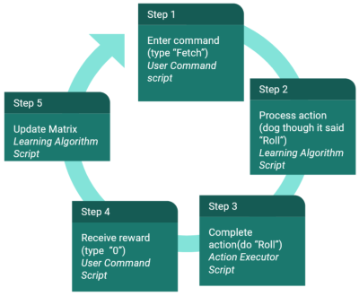
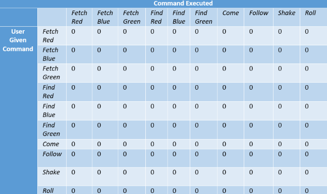
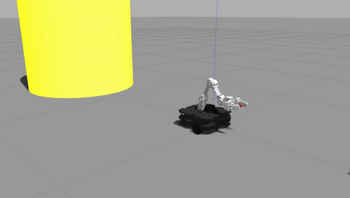
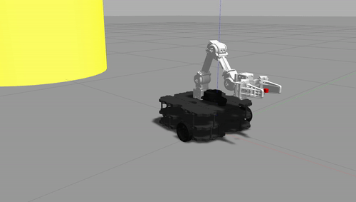
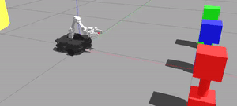
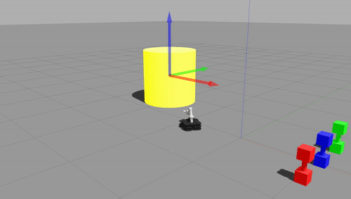
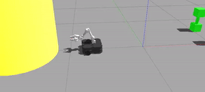

# Train the Robodog

**Team name: To Do Pt2**

**Team members: Li Arditi, Kiana Hobbs, Hunter Thompson, Sebastian Villegas Mejia**

## How to Run Program
#### RoboDog Program:
0. `roscore`
1. `roslaunch robodog robodog.launch`
2. `rosrun robodog user_interface.py`
#### Covergence Script:
1. `roscore`
2. `rosun robodog learning_algo.py`
3. `rosrun robodog phantom_movement.py`

## Project Description

Behold! An interactive robot-dog you can train and love during these isolating times. 

The goal of this project is to program a robot to be pet-like because we wanted to connect reinforcement learning with human-computer interaction. Machine learning has become a hot-topic in computer science/robotics, and with the pandemic people have had more time to play with and train their pets. So, we thought it would be interesting to combine these two things and create something that encourages human-robot interaction similar to/based on the way humans interact with pets (more specifically dogs because they're more responsive and dependent on humans). Overall, we were able to make a robot pet-like in that it can be given specific commands and execute the correct action (while also (hopefully) having some personality). The different commands included: roll (spin around), shake (extend arm and move up and down), come (go to the person, as represented by a yellow object), follow (follow the yellow object as the user moves it around), find \[color\] (go to the dumbbell of the specified color), and fetch \[color\] (go to and bring back the dumbbell of the specified color).

The major robotics algorithm used to accomplish this behavior was a reinforcement learning algorithm that used reward values given by the user once the robot completed an action. The other main components included robot perception and movement and the user interface. The three components interacted with each other through custom ros topics and messages. First, the user interface prompts the user for a command. If that command is valid then it publishes to `/robodog/user_cmd` which the learning algorithm node subscribes to. Based on the current matrix, it decides the action the robot will take and publishes it to `/robodog/action` which the action execution node subscribes to. Once the action is complete, the action execution node publishes the status of the robot/action and which action it completed/attempted to `/robodog/action_status` which the user interface node subscribes to. Once the user interface node receives that the action was complete (or failed), it prompts the user for a reward which is published to `/robodog/action_reward` for the learning algorithm node to receive and update the matrix with. 

## System Architecture:

### 1. Reinforcement Learning
(implemented in `/scripts/learning_algo.py` and tested in `/scripts/phantom_movement.py`)

`/scripts/learning_algo.py`

To emphasize the training aspect of our RoboDog, we wanted to ensure that there was some form of learning involved in determining how the RoboDog would react to commands. To implement the idea of exploration over exploitation, we used the Q-Learning Algorithm, a probability space, and a greedy epsilon. We initialized a Q-Matrix with on the given command and the command executed, such as the user inputs "fetch blue" (given command) and the RoboDog completes the action "roll" (command executed).

To draw a random action (`draw_random_action()`) from the learning matrix, we normalized the values in the matrix to extrapolate it onto a probability space, and chose a random action from that space. Moreover, to further emphasize some exploration, we added a greedy epsilon of 0.9, such that 90% of the time the algorithm choosing a value using the probability space and 10% of the time it is completely random. 

Whenever a reward was published, the Q-Matrix would update for the given cell. The published rewards were scaled down to be out of 1 from 10. Also, if the RoboDog received a 0 reward from the user, that reward is converted to a negative 10, or -1 scaled down, to include negative reinforcement. Moreover, given the large state space for our algorithm, we had to select an alpha of 1 and a gamma of 0.01 to have a semi-reasonable speed learning time. However, even with this alpha and gamma, it could take up to 300 iterations to converge a single command. 

`/scripts/phantom_movement.py`

Given our program is user command driven and not completely automated, we developed a phantom movement script, similar to that from the Q-Learning project to gauge learning speed and convergence. The phantom script implements an all or nothing rewarding system (either the command is right, 10, or wrong, 0), that iterates through the possible commands until convergence is reached for each trick. We check convergence by implementing the normalizing function from the learning matrix to see if the matrix cell for where the given command matches the executed command has a probability of more than 99%. We initially had determined convergence at a higher probability, but for the sake of speedy up the convergence process, we lowered it to its current value.

### 2. Robot Perception and Movement
(implemented in `/scripts/actions.py`)

When designing the movement, we tried to make our functions to be general enough
to be reused by multiple components and easily adjustable. For this reason, we 
reused functions such as `turn_to` and `go_to` to call many of our actions, such
as find and fetch. These functions allowed the bot to turn towards the indicated
color and go towards it respectively. Additionally, a lot of time was spent 
tinkering with the robot arm and grip control to make the actions more robust. 
This can be seen in the `pick_up_dumbbell` function as we spent time 
experimenting with the velocity and gripper so that the dumbbell would not
fall down when picked up from a variety of angles. Additional functionality was
added through image processing to detect whether the dumbbell was successfully
picked up and to try again if it failed. Finally, all of the arm control actions 
were programmed based on what was asthetically good for the bot, such as `shake`.

### 3. User Interface
(implemented in `/scripts/user_interface.py`)

Although this component of the project didn't involve many complicated algorithms or code, it is still a major component. This is how the user will interact with the robot to give it commands and rewards. The structure of the code is based on the following logic:
* when the script is run, print a welcome message, the possible commands, reward instructions, and how to quit (lines 28-34)
* if the robot is not completing an action or getting a reward, prompt the user to enter a command; if the command is 'quit', shutdown the node (lines 59-65)
* if the command is valid, publish it to the topic `/robodog/user_cmd`; otherwise, print an error message and prompt again until command is valid (lines 67-82)
* once the action is complete or failed, prompt the user for a reward (integar 0-10); if the reward is valid, publish it to the topic `/robodog/action_reward`, then restart the loop; otherewise, print an error message and prompt again until reward is valid (lines 84-113)

In order to know if the published action has been completed or failed, the user interface node subscribes to `/robodog/action_status` which provides information about the status of the robot action ('complete', 'in progress', 'failed', or 'idle'), along with the action id it completed/attempted to complete. In addition, the user interface node keeps track of how many times each command has been called (correctly/successfully). That information is published with the same message that contains the user input.

## Challenges

One of the main challenges we had was identifying the scope of our project. Especially at the beginning we were having trouble deciding how the reward system and reinforcement learning should work. We were eventually able to resolve the issue by taking a step back and first clearly defining the actions we intended on implementing. From that we were able to more concretely figure out what we needed the user interface and learning algorithm to do.

Another major challenge that we faced throughout the project was defining the 
world and making sure that everything loaded correctly in it. For example, 
initially we tried to have a human model to represent the person in our
project; however, we quickly noticed that the model was not at all pleasing
to the eye in bright yellow on top of having issues with the feet of the person
getting in the way and the gap between the person's leg being somewhat 
problematic. Thus, we opted for a yellow cylinder. On top of this, we had
difficulty changing the colors of gazebo models initially as we tried to edit
the .dae files for the models, but had many issues doing so. It took us a while
to realize that we could edit models in the gazebo simulator itself, which 
greatly simplified the process. Finally, we encountered issues of making sure 
that our world file did not contain the bot as this bloated that file, and it 
was much simpler to launch the bot in the launch file instead. 

## Future Work

* One aspect of the bot that we would improve upon in the future would be 
  increasing the complexity of the bots actions. There are two main ways that we 
  thought we could do this. The first would be increasing the complexity of the 
  fetch/find action by including object detection and avoidance on top of having
  the bot search for the object (discussed more further on). We could have also 
  included further more complex actions such as an obstacle course that the bot
  could run or including a ramp that the bot would traverse over.
* As mentioned above, we considered making the bot more complex through having
  it search and avoid obstacles when performing fetch/find. In the future, we
  also would have liked to include walls and a defined room that way the bot 
  could search around this space for the dumbbells and avoid any ways/obstacles
  in the way. It might better mimic a dog looking around a room for their
  favorite toy and bringing it back to the owner. 

## Takeaways

* Define and assign components to work on early
  * Clearly splitting up and defining work from the start made it really easy to make sure everything got done

* Communication is key
  * Related to the first takeaway, but it was essential that we communicated 
    throughout the project 
  * It was important for us especially to have both group meetings where we could
    all come together and discuss the larger strokes of our project/create 
    presentations as well as being able to message each other for smaller details
  * While integrating all of our components, it was much simpler to be able to 
    ask each other about various features through messaging and debugging 
    together as each person knew their respective component best

## ROS bags
1. A ros bag titled "convergence.bags" includes the recording of the `/scripts/learning_algo.py' and '/scripts/phantom_movement.py' on a diagonal matrix.
2. 

## Final Product Gifs

### Actions

Roll

Shake

Come

Follow

Find (Red)

Fetch (Green)

