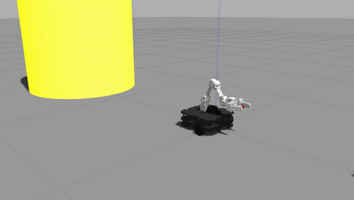
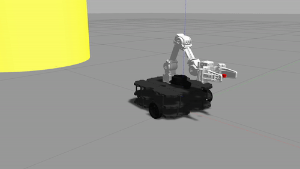
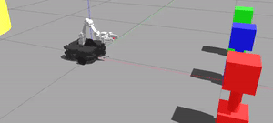
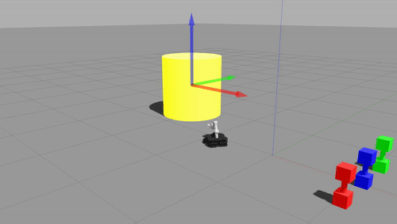

# Train the Robodog

**Team name: To Do Pt2**

**Team members: Li Arditi, Kiana Hobbs, Hunter Thompson, Sebastian Villegas Mejia**

## Project Description
[Describe the goal of your project, why it's interesting, what you were able to make your robot do, and what the main components of your project are and how they fit together - please include diagrams and gifs when appropriate]

Behold! An interactive robot-dog you can train and love during these isolating times. 

The goal of this project is to program a robot to be pet-like because we wanted to connect reinforcement learning with human-computer interaction. Machine learning has become a hot-topic in computer science/robotics, and with the pandemic people have had more time to play with and train their pets. So, we thought it would be interesting to combine these two things and create something that encourages human-robot interaction similar to/based on the way humans interact with pets (more specifically dogs because they're more responsive and dependent on humans). Overall, we were able to make a robot pet-like in that it can be given specific commands and execute the correct action (while also (hopefully) having some personality). The different commands included: roll (spin around), shake (extend arm and move up and down), come (go to the person, as represented by a yellow object), follow (follow the yellow object as the user moves it around), find \[color\] (go to the dumbbell of the specified color), and fetch \[color\] (go to and bring back the dumbbell of the specified color).

The major robotics algorithm used to accomplish this behavior was a reinforcement learning algorithm that used reward values given by the user once the robot completed an action. The other main components included robot perception and movement and the user interface. [finish writing about how they fit together briefly]

[any diagrams?]

## System Architecture:
[Describe in detail the robotics algorithm you implemented and each major component of your project, highlight what pieces of code contribute to these main components]

### 1. Reinforcement Learning
(implemented in `/scripts/learning_algo.py`)

This project is centered around a robotics algorithm for reinforcement learning. 

### 2. Robot Perception and Movement
(implemented in `/scripts/actions.py`)

### 3. User Interface
(implemented in `/scripts/user_interface.py`)

Although this component of the project didn't involve many complicated algorithms or code, it is still a major component. This is how the user will interact with the robot to give it commands and rewards. The structure of the code is based on the following logic:
* when the script is run, print a welcome message, the possible commands, reward instructions, and how to quit (lines 28-34)
* if the robot is not completing an action or getting a reward, prompt the user to enter a command; if the command is 'quit', shutdown the node (lines 59-65)
* if the command is valid, publish it to the topic `/robodog/user_cmd`; otherwise, print an error message and prompt again until command is valid (lines 67-82)
* once the action is complete or failed, prompt the user for a reward (integar 0-10); if the reward is valid, publish it to the topic `/robodog/action_reward`, then restart the loop; otherewise, print an error message and prompt again until reward is valid (lines 84-110)

In order to know if the published action has been completed or failed, the user interface node subscribes to `/robodog/action_status` which provides information about the status of the robot action ('complete', 'in progress', 'failed', or 'idle'), along with the action id it completed/attempted to complete. In addition, the user interface node keeps track of how many times each command has been called (correctly/successfully). That information is published with the same message that contains the user input.

## Challenges
[These should take a similar form and structure to how you approached these in the previous projects (1 paragraph each for the challenges and future work and a few bullet points for takeaways)]
- defining the scope of the project (esp in terms of the reinforcement learning and the rewward system)

## Future Work

- adding more commands and commands that are more complex
- maybe make the learning algorithm more robust?
- adding walls
- defining convergence

## Takeaways

* Define and assign components to work on early
  * Clearly splitting up and defining work from the start made it really easy to make sure everything got done

* takeaway2
  * 

* takeaway3
  * 

## Final Product Gifs

### Actions

Roll

Shake

Come

Follow

Find

Follow

### Emotes

Happy

Sad

### Learning

